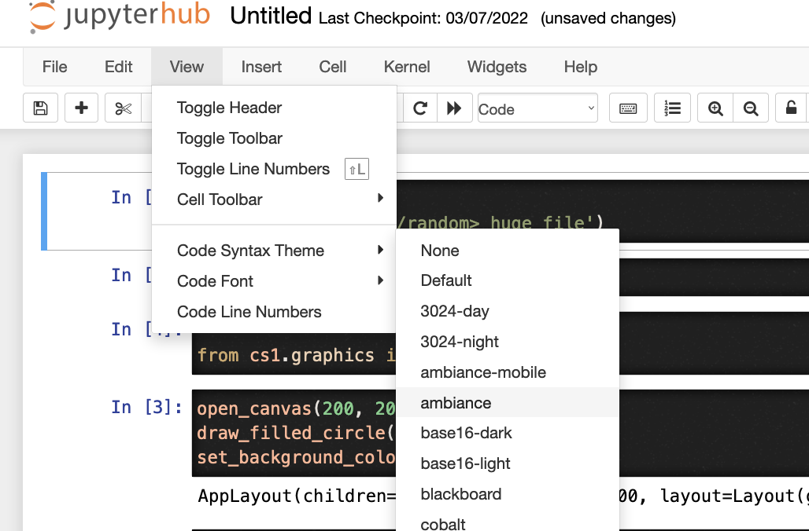
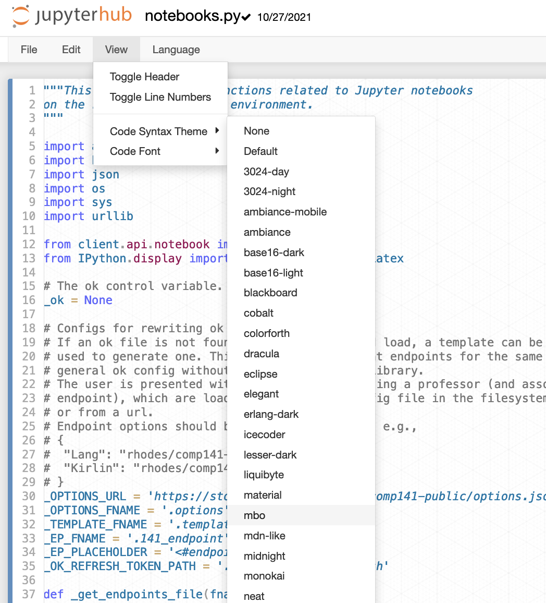

# Jupyter themes

Fork of `merqurio/jupyter_themes`.

* Adds support for editor.
* Adds ability to turn off syntax highlighting.
* Fixes a few small typos and bugs.




### Installation:

```shell
$ git clone <url>
$ jupyter nbextension install jupyter_themes/ [--sys-prefix|--user]
$ jupyter nbextension enable jupyter_themes/theme_selector --section='common'
```

## License

The MIT License (MIT) | See LICENSE.md

Copyright (c) 2015, 2016, 2017 Gabi de Maeztu, David Lukes
